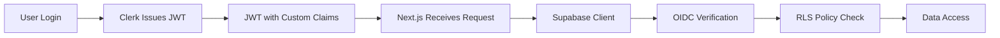
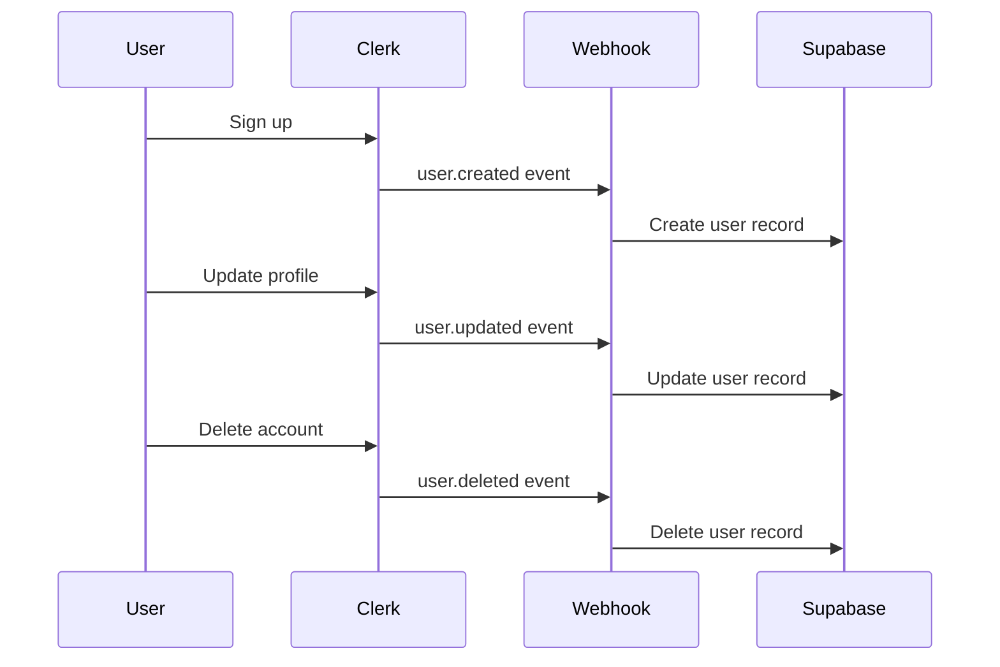

# Multi-Tenant SaaS Architecture Guide

This document provides a deep dive into the architectural decisions, patterns, and design principles of the multi-tenant SaaS template.

## 🏗️ Architecture Overview

### High-Level System Design

```
┌─────────────────┐    ┌─────────────────┐    ┌─────────────────┐
│   Next.js App   │────│   Clerk Auth    │────│   Webhooks      │
│                 │    │                 │    │                 │
│ • Server Actions│    │ • JWT Tokens    │    │ • User Sync     │
│ • Client Comps  │    │ • Session Mgmt  │    │ • Lifecycle     │
│ • API Routes    │    │ • User Metadata │    │                 │
└─────────┬───────┘    └─────────────────┘    └─────────┬───────┘
          │                                              │
          │            ┌─────────────────┐              │
          └────────────│  Supabase DB    │──────────────┘
                       │                 │
                       │ • PostgreSQL    │
                       │ • RLS Policies  │
                       │ • OIDC Verif.   │
                       └─────────────────┘
```

### Core Components

1. **Next.js Application** - Frontend and backend API
2. **Clerk Authentication** - Identity provider with session management
3. **Supabase Database** - PostgreSQL with Row Level Security
4. **Webhook Integration** - User lifecycle synchronization

## 🔐 Authentication Architecture

### Third-Party Auth Integration (OIDC)

**Why Third-Party Auth vs JWT Signing Keys:**



**Benefits:**
- ✅ No shared secrets between services
- ✅ Asymmetric key verification (more secure)
- ✅ Automatic key rotation via OIDC discovery
- ✅ Industry standard approach
- ✅ Better isolation between auth and data layers

### JWT Token Structure

```json
{
  // Standard JWT claims
  "iss": "https://your-domain.clerk.accounts.dev",
  "sub": "user_12345",
  "aud": ["your-audience"],
  "exp": 1234567890,
  "iat": 1234567890,

  // Custom claims for multi-tenancy
  "role": "authenticated",           // PostgreSQL role (always 'authenticated')
  "user_role": "org_admin",         // Application role (platform_admin|org_admin|org_member)
  "org_id": "uuid-of-organization"  // Organization scope
}
```

### Role-Based Access Control (RBAC)

```typescript
// Three-tier role hierarchy
const ROLES = {
  platform_admin: {
    level: 3,
    scope: 'global',
    description: 'Super admin with cross-organization access'
  },
  org_admin: {
    level: 2,
    scope: 'organization',
    description: 'Admin within specific organization'
  },
  org_member: {
    level: 1,
    scope: 'organization',
    description: 'Standard user within organization'
  }
};
```

## 🗄️ Database Architecture

### Multi-Tenant Schema Design

```sql
-- Core multi-tenant tables
organisations          -- Organization entities (tenants)
├── users              -- User profiles (synced from Clerk)
├── roles              -- RBAC role definitions
├── user_roles         -- User-to-role assignments
└── [business_entities] -- Your business data (organization-scoped)
```

### Row Level Security (RLS) Strategy

**Performance-Optimized Approach:**
- Uses JWT claims directly in RLS policies
- No database lookups in security policies
- Automatic filtering based on user context

```sql
-- Example RLS policy pattern
CREATE POLICY "org_isolation" ON business_table
FOR SELECT TO authenticated
USING (
  -- Standard org isolation
  organisation_id = (auth.jwt() ->> 'org_id')::uuid
  OR
  -- Platform admin override
  (auth.jwt() ->> 'user_role') = 'platform_admin'
);
```

### Foreign Key Relationships

```sql
-- All business tables follow this pattern
CREATE TABLE your_business_table (
  id UUID PRIMARY KEY DEFAULT gen_random_uuid(),

  -- Business-specific fields
  name VARCHAR NOT NULL,
  -- ... your fields ...

  -- Required multi-tenant columns
  user_id UUID REFERENCES users(id) NOT NULL,
  organisation_id UUID REFERENCES organisations(id) NOT NULL,
  created_at TIMESTAMPTZ DEFAULT NOW(),
  updated_at TIMESTAMPTZ DEFAULT NOW()
);
```

### Indexing Strategy

```sql
-- Performance indexes for multi-tenant queries
CREATE INDEX idx_table_org_id ON your_table(organisation_id);
CREATE INDEX idx_table_user_id ON your_table(user_id);
CREATE INDEX idx_table_org_user ON your_table(organisation_id, user_id);
CREATE INDEX idx_table_created ON your_table(created_at DESC);
```

## 🚀 Application Architecture

### Server Actions Pattern

**Organization-Scoped Operations:**
```typescript
// Pattern for all business operations
export const getBusinessEntities = async () => {
  // 1. Validate user context
  const user = await getCurrentUser();
  if (!user?.organisationId) return [];

  // 2. Create authenticated Supabase client
  const supabase = await createSupabaseClient();

  // 3. Query data (RLS automatically filters by org)
  const { data } = await supabase
    .from("business_table")
    .select("*");

  return data;
};

export const createBusinessEntity = async (entity: Entity) => {
  // 1. Require authenticated user with org
  const { user, organisationId } = await requireUserWithOrg();

  // 2. Insert with organization context
  const { data } = await supabase
    .from("business_table")
    .insert({
      ...entity,
      user_id: user.clerkId,
      organisation_id: organisationId
    });

  return data[0];
};
```

### Error Handling Strategy

```typescript
// Centralized error handling for common scenarios
export class AuthError extends Error {
  constructor(message: string) {
    super(message);
    this.name = 'AuthError';
  }
}

export class OrganizationError extends Error {
  constructor(message: string) {
    super(message);
    this.name = 'OrganizationError';
  }
}

// Usage in server actions
export const businessOperation = async () => {
  const user = await getCurrentUser();

  if (!user) {
    throw new AuthError('User not authenticated');
  }

  if (!user.organisationId) {
    throw new OrganizationError('User not assigned to organization');
  }

  // Proceed with operation
};
```

### Client-Side Architecture

**Component Hierarchy:**
```tsx
// Layout Components
app/layout.tsx                 // Root layout with ClerkProvider
├── components/Navigation.tsx  // Auth-aware navigation
├── components/UserProfile.tsx // Current user context
└── components/OrgSwitcher.tsx // Organization selection (if multi-org)

// Page Components
app/[business]/page.tsx        // List view (server component)
├── components/EntityCard.tsx  // Individual entity display
├── components/EntityForm.tsx  // Create/edit forms (client component)
└── components/EntityActions.tsx // Action buttons (client component)
```

## 🔒 Security Architecture

### Defense in Depth

1. **Authentication Layer** (Clerk)
   - JWT token validation
   - Session management
   - User lifecycle events

2. **Authorization Layer** (Application)
   - Role-based access control
   - Organization context validation
   - Server action guards

3. **Data Layer** (Supabase RLS)
   - Row-level security policies
   - Organization isolation
   - Automatic data filtering

### Security Boundaries

```typescript
// Security boundary enforcement
┌─────────────────────────────────────┐
│           Client Browser            │
│ • No sensitive data caching         │
│ • Auth state from Clerk             │
└─────────────┬───────────────────────┘
              │ HTTPS Only
┌─────────────▼───────────────────────┐
│         Next.js Server              │
│ • JWT validation via Clerk          │
│ • Server action authentication      │
│ • Organization context validation   │
└─────────────┬───────────────────────┘
              │ Service Role / JWT
┌─────────────▼───────────────────────┐
│        Supabase Database            │
│ • RLS policies active               │
│ • JWT claims verification           │
│ • Automatic data isolation          │
└─────────────────────────────────────┘
```

### Data Isolation Verification

```sql
-- Test organization isolation
-- User from Org A should not see Org B data
SELECT COUNT(*) FROM recipes
WHERE organisation_id != '(current_user_org_id)';
-- Should return 0 for non-platform admins
```

## 📊 Performance Architecture

### Query Optimization Strategy

1. **RLS Performance**:
   - JWT claims used directly (no DB lookups in policies)
   - Indexes on organization_id for fast filtering
   - Minimal policy complexity

2. **Data Fetching**:
   - Server Components for initial data loading
   - Client Components only for interactivity
   - Parallel data fetching where possible

3. **Caching Strategy**:
   - Next.js automatic caching for static content
   - Supabase connection pooling
   - Client-side state management for UI

### Scalability Considerations

```typescript
// Pagination pattern for large datasets
export const getBusinessEntities = async (
  page: number = 1,
  limit: number = 20
) => {
  const offset = (page - 1) * limit;

  const { data, count } = await supabase
    .from("business_table")
    .select("*", { count: "exact" })
    .range(offset, offset + limit - 1)
    .order("created_at", { ascending: false });

  return {
    data,
    pagination: {
      page,
      limit,
      total: count,
      hasMore: count > offset + limit
    }
  };
};
```

## 🔄 Data Synchronization Architecture

### User Lifecycle Management



### Webhook Implementation

```typescript
// app/api/webhooks/clerk/route.ts
export async function POST(req: Request) {
  // 1. Verify webhook signature
  const evt = await verifyWebhook(req);

  // 2. Handle user lifecycle events
  switch (evt.type) {
    case 'user.created':
      await createUserInDatabase(evt.data);
      break;
    case 'user.updated':
      await updateUserInDatabase(evt.data);
      break;
    case 'user.deleted':
      await deleteUserFromDatabase(evt.data);
      break;
  }

  return new Response('OK', { status: 200 });
}
```

## 🔧 Configuration Management

### Environment-Specific Configuration

```typescript
// lib/config.ts
const config = {
  development: {
    supabase: {
      url: process.env.NEXT_PUBLIC_SUPABASE_URL,
      anonKey: process.env.NEXT_PUBLIC_SUPABASE_ANON_KEY,
      serviceRole: process.env.SUPABASE_SERVICE_ROLE_KEY,
    },
    clerk: {
      publishableKey: process.env.NEXT_PUBLIC_CLERK_PUBLISHABLE_KEY,
      secretKey: process.env.CLERK_SECRET_KEY,
      webhookSecret: process.env.CLERK_WEBHOOK_SECRET,
    }
  },
  production: {
    // Production-specific overrides
    // ... same structure with prod values
  }
};
```

### Feature Flags

```typescript
// lib/features.ts
export const features = {
  multiOrganization: process.env.FEATURE_MULTI_ORG === 'true',
  advancedRoles: process.env.FEATURE_ADVANCED_ROLES === 'true',
  analytics: process.env.FEATURE_ANALYTICS === 'true',
};

// Usage in components
if (features.multiOrganization) {
  // Render org switcher
}
```

## 📈 Monitoring and Observability

### Key Metrics to Track

1. **Authentication Metrics**:
   - Sign-up/sign-in success rates
   - JWT token validation failures
   - Session duration

2. **Multi-Tenancy Metrics**:
   - Organization data isolation breaches
   - Cross-org access attempts
   - RLS policy execution time

3. **Performance Metrics**:
   - Database query execution time
   - API response times
   - Page load performance

### Error Tracking

```typescript
// lib/monitoring.ts
export const trackError = (error: Error, context: Record<string, any>) => {
  if (process.env.NODE_ENV === 'production') {
    // Send to monitoring service (Sentry, etc.)
    console.error('Error:', error.message, context);
  }
};

// Usage in server actions
try {
  await businessOperation();
} catch (error) {
  trackError(error, {
    userId: user.clerkId,
    organizationId: user.organisationId,
    operation: 'businessOperation'
  });
  throw error;
}
```

## 🚀 Deployment Architecture

### Production Environment

```yaml
# docker-compose.yml example
version: '3.8'
services:
  app:
    build: .
    environment:
      - NODE_ENV=production
      - NEXT_PUBLIC_SUPABASE_URL=${SUPABASE_URL}
      - SUPABASE_SERVICE_ROLE_KEY=${SUPABASE_SERVICE_KEY}
      - NEXT_PUBLIC_CLERK_PUBLISHABLE_KEY=${CLERK_PUB_KEY}
      - CLERK_SECRET_KEY=${CLERK_SECRET}
    ports:
      - "3000:3000"
```

### CI/CD Pipeline

```yaml
# .github/workflows/deploy.yml
name: Deploy
on:
  push:
    branches: [main]

jobs:
  test:
    runs-on: ubuntu-latest
    steps:
      - uses: actions/checkout@v2
      - name: Run tests
        run: |
          npm install
          npm run test
          npm run test:integration

  deploy:
    needs: test
    runs-on: ubuntu-latest
    steps:
      - name: Deploy to production
        run: |
          # Deploy to your hosting platform
          # Run database migrations
          # Verify deployment health
```

## 🔄 Migration and Scaling

### Database Migration Strategy

```sql
-- Migration versioning pattern
-- 001_initial_multi_tenant_schema.sql
-- 002_add_business_tables.sql
-- 003_add_performance_indexes.sql

-- Always include rollback procedures
-- Test migrations on staging first
-- Use transactions for atomic changes
```

### Horizontal Scaling Considerations

1. **Database Scaling**:
   - Read replicas for query performance
   - Connection pooling via Supabase
   - Partitioning large tables by organization

2. **Application Scaling**:
   - Stateless server design (Next.js)
   - CDN for static assets
   - Load balancer for multiple instances

3. **Organization Scaling**:
   - Efficient RLS policies for large org counts
   - Bulk operations for multi-org admin tasks
   - Monitoring for per-org resource usage

---

This architecture provides a solid foundation for building scalable, secure multi-tenant SaaS applications while maintaining developer productivity and operational simplicity.